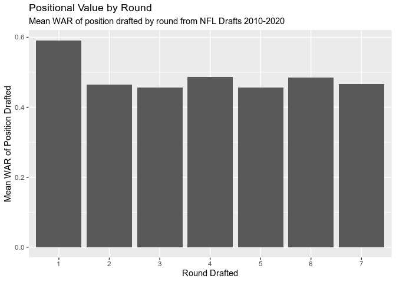
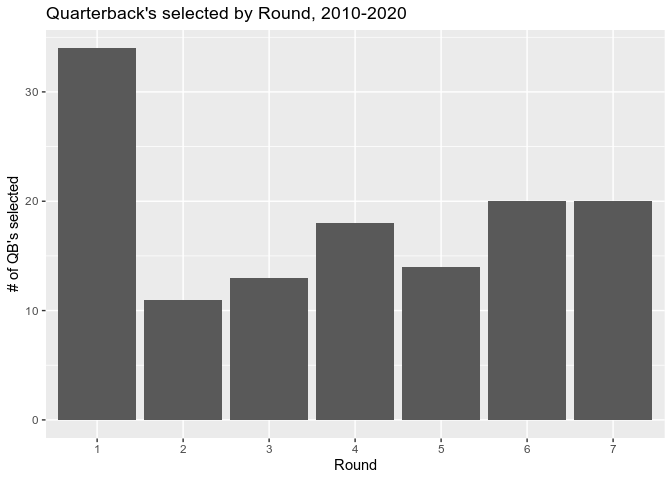
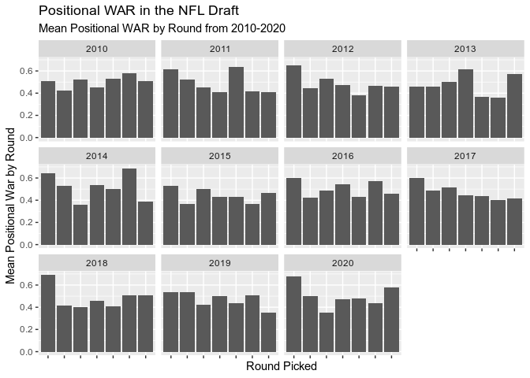
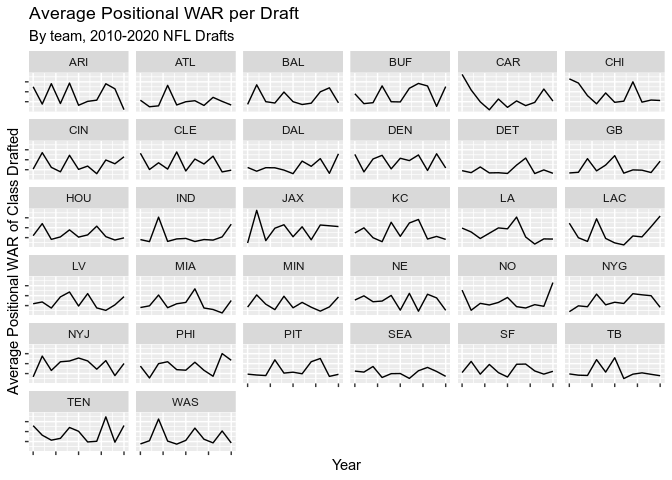
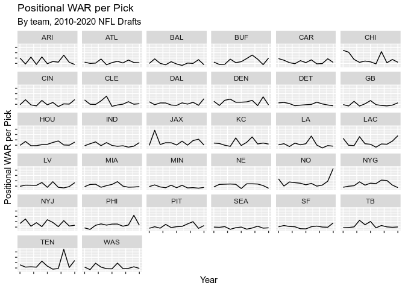

Positional Value and The NFL Draft: 2010-2020
================
DMD319

# Intro

Every NFL Draft, some of the most heated debates that take place have to
do with positional value. Teams who are in need of a quarterback, and
choose not to select one, or teams who draft running backs early, come
under fire. I wanted to take a look at the data and see if these
critiques are valid. Here are some of the questions I wanted to answer:

-   Do teams take positional value into account? If so, how much of this
    is exaggerated due to quarterbacks? As analytics has grown in the
    sport, has this trended upwards over time?
-   Should teams take positional value into account? Do teams who put a
    strong emphasis on positional value in the draft render better
    results on the field?

Data used was from Mike Renner at PFF, using his WAR positional value
chart, as well as Lee Sharpe’s NFL Data for draft and wins information.
A few key assumptions / problems:

-   A handful of players from the draft data were just listed as “OL”.
    I, by default, included these in the “IOL” pool.
-   I included all specialists drafted together and labeled them with a
    WAR of 0.
-   The classic problem of edge rusher vs defensive end vs outside
    linebacker is at play as well. Any players listed as defensive ends
    I labeled with the Edge Rusher value for WAR, and any player listed
    as a linebacker I labeled as an LB. Von Miller, for example, is
    listed as an LB, even though he’s better classified as an Edge
    Rusher.

# Do teams take positional value into account? How does this differ by round?

<!-- -->

This shouldn’t be too surprising to see that Round 1 has the highest
positional WAR value, as this is where the best players at the best
positions go. Let’s compare this to the number of quarterback’s drafted,
to see if that’s what’s pulling it so high.

<!-- -->

This is interesting. While the round with the most QB’s taken is round
1, it certainly doesn’t explain the flat-lining across the rest of the
rounds. This could mean that while teams recognize the value of taking a
quarterback early, they strongly discount positional value through the
remainder of the draft.

It may also be the case that analytics weren’t as popular through the
early portion we’re working with. Let’s see how these graphs have
changed over time.

# Positional value trend over time

<!-- -->

    ## [1] -0.04569137

This unfortunately doesn’t show us any strong trends, other than it’s
always been decently random. No strong trend isn’t very promising,
however. It may show that teams still discount positional value.

The last trend I’ll look at is to see if specific teams have altered
their own analysis of Positional WAR over time. The draft can be viewed
almost as a zero-sum game in aggregate.

<!-- -->

This also doesn’t show any significant trend across the board, but also
doesn’t point towards teams becoming more knowledgeable on positional
value in the draft.

This made me curious about what Mean WAR / Pick looks like. In the above
example, if a team only has one pick and selects a quarterback, it would
report a very high value, but this isn’t necessarily an accurate example
of team-building, since the rest of the roster wasn’t improved. Another
issue this doesn’t address is how it impacts team success, as many of
these teams had variable outcomes from 2010-2020.

<!-- --> This,
again, is a bit too messy to actually show anything. It’s time to start
asking the core question – does drafting for positional value, or at
least trending in that direction, really matter? Our goal isn’t to show
that teams need to start specifically drafting for positional value, but
if by showing that teams who do focus on positional value in the draft
have more success, it can help make the difficult drafting decisions in
the grey area – do you take what you graded as a top 5 IOL, or the 10th
best WR, for example.

# Should teams take positional value into account?

To gather the true value of a draft, I’ll compare a team’s average
positional WAR value to their success over the next 4 years. This makes
more sense to do than just tracking the following year’s success, as
rookies will sign 4 year contracts.

The correlation of average positional WAR value per draft for a team,
and their wins over the next 4 years, is -0.0663039.

This, unfortunately, gives us basically no correlation. I would guess
this has to do with the fact that failing teams often shoot to draft
high WAR players (read: quarterbacks), and continue to fail, skewing the
numbers. I’ll give this one more try by filtering out the first round.
As we saw in the earlier figures, teams tend to do a good job of
drafting high WAR positions in the first round.

The correlation of average positional WAR value per draft in rounds 2-7
for a team, and their wins over the next 4 years, is -0.001797.

This also provides no correlation. Instead of subbing out round 1, I’ll
sub out quarterbacks, and see if this provides any clearer answers. This
unfortunately is still a messy valuation, as it now discredits drafting
a QB.

The correlation between the average positional value per draft for picks
that were not quarterbacks, and a team’s win values over the next 4
years, is -0.0634575.

This provides a slightly stronger negative correlation, although still
hardly any correlation at all. This shows that there isn’t much of a
correlation with winning and picking for positional value, even outside
of the realm of quarterbacks.

I’ll take a look at WAR per pick, just to see if this yields anything
interesting.

The correlation between average positional WAR value per pick of a
draft, and a team’s wins over the next 4 years, is -0.0941055.

Again, no correlation. The last place I’ll look is to see if first round
positional value matters. As demonstrated in the earlier figures, the
positional WAR value taken is much higher in the first round than in
rounds 2-7. This could also be explained by the number of QBs taken in
the first round, so we’ll do another filtering quarterbacks out of the
system as well.

The correlation between average positional WAR value of first round
picks, and a team’s wins over the next 4 years, is -0.1109194. The
correlation between average positional WAR value of first round picks
outside of QB’s, and a team’s wins over the next 4 years, is -0.0816541.

There’s still no strong argument to draft for positional value here, as
neither ended up very correlated.

# So what?

The best conclusion I can come up with here can be summarized as
follows:

-   Teams take into account positional value the most in the first
    round, particularly with the influx of quarterbacks. Taking
    positional value into account the “most” doesn’t mean much here,
    though, as they don’t seem to value it much through the entire
    draft. However, valuing by position doesn’t seem to have any type of
    correlation with success.

-   Teams don’t really consider positional value in the later rounds,
    but this doesn’t seem to have a negative impact on success either.

-   Because there’s so much uncertainty in how a player will translate
    to the NFL, there’s a lot of noise in how these selections and their
    positional value actually translate to success. Teams don’t draft
    for positional need, nor does there seem to be any trend pointing
    towards a good reason why they should.

-   This dilemma adds nuance when also taking into consideration the
    price of players, particularly with the rookie pay scale, and how
    free agency shapes out. My conjecture would be that given the
    uncertainty of a player selected in the draft, it’s best to just
    select best player available, ignoring positional need, but in free
    agency, placing a high premium on positional value, as the prices of
    these players are significantly higher as well.
